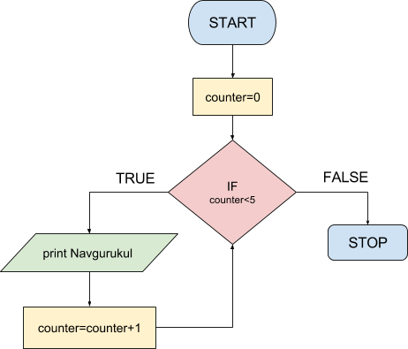

```ngMeta
name: Writing Code for If Statements
completionMethod: manual
```

# Writing code for loops

Abhi tak humne loops ke flowcharts banane seekhein hain. Lekin flowcharts toh sirf humein yeh samajhne mein help karte hain ki computer kaise sochte hain. Asal mein toh humein toh humesha computers ko code likh ke hi samjhana padega.

Loops samajhte hue humne yeh flowchart banaya tha. Ab hum iss flowchart ka code likhna seekhte hain.



Iss flowchart ka code kuch aise likha jayega:

```python
counter = 0
while counter < 5:
	print "NavGurukul"
	counter = counter + 1
```

Iss code mein:

1. `counter` naam ka ek variable define ho raha hai jiski value `0` hai. Flowchart mein bhi same cheez ho rahi hai.
2. Fir ek `while` loop likha hai jiske aage ek condition hai `counter < 5`. `While` ka matlab ho jab tak (जब तक). Toh ek tareeke se `while` loop python ko bolta hai ki jab tak aage di hui condition `True` hai tab tak loop chalao.
3. Jaise hi loop khatam hoga toh while ke bahar wala code chalega. Yeh samajhne ke liye neeche diye hua code chalao:

```python
counter = 0 
while counter < 5:
	print "NavGurukul"
	counter = counter + 1
print "Yeh sirf ek baar print hoga"
```

Yeh code chala ke dekhoge toh `"NavGurkul"` 5 baar print hoga aur last waali line sirf ek baar.

# Ek aur example

Maan lo humne code likhna hai jisme humne 1 se 100 tak saare number print karne hai jo 2 se divide hote hain. Toh hum while loops ka use kar ke aise likhenge:


```python
counter = 1
while counter < 100:
	if counter % 2 == 0:
		print counter
	counter = counter + 1
```

**Note: Yahan humne counter 1 se isliye shuru kiya hai kyunki humne 1 se 100 tak print karne hai aur na ki 0 se 99 tak.**


Ab aage aapne kuch questions ke flowcharts aur assignments dono bana ke submit karne hain.